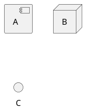

# PlantUML

## Component Diagrams

### Shapes


### Styling
Colours for classes
```sh
component "A" as a <<push>>
skinparam component {
  backgroundColor<<push>> #95e683
}
```

```puml
@startuml
component "A" as a <<push>>
skinparam component {
  backgroundColor<<push>> #95e683
}
@enduml
```


## Formatting
https://plantuml-documentation.readthedocs.io/en/latest/formatting/all-skin-params.html
