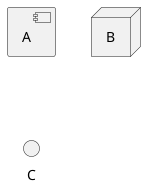

# PlantUML

## Component Diagrams

### Shapes

```puml
@startuml
component "A" as a
node "B" as b
interface "C" as c
@enduml
```

### Styling
Colours for classes
```sh
component "A" as a <<push>>
skinparam component {
  backgroundColor<<push>> #95e683
}
```

```puml
@startuml
component "A" as a <<push>>
skinparam component {
  backgroundColor<<push>> #95e683
}
@enduml
```