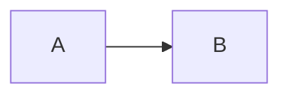

# Mermaid

## Syntax

### Flow Chart

#### Shapes
Default is square for a node

Cylinder
```sh
id1[(This is the text in the cylinder)]
```

Circles
```
id1((This is the text in the circle))
```

#### Links
Solid Line
```sh
A --> B
```
Open Line
```sh
A --- B
```
Text on links
```sh
A-- This is the text! ---B
```
#### Styling

##### Links
Links have no id, so the order of the number of link is defined instead
```sh
linkStyle 3 stroke:#ff3,stroke-width:4px,color:red;
```
##### Nodes

```sh
classDef push fill:#95e683;
App:::push
```

## References
_https://mermaid-js.github.io/mermaid/diagrams-and-syntax-and-examples/_
