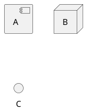

# PlantUML

## Component Diagrams

### Shapes


### Styling
Colours for classes
```sh
component "A" as a <<push>>
skinparam component {
  backgroundColor<<push>> #95e683
}
```


```puml
@startuml
component "A" as a <<push>>
skinparam component {
  backgroundColor<<push>> #95e683
}
@enduml
```

### Sprites
```
sprite $businessProcess [16x16/16] {
FFFFFFFFFFFFFFFF
FFFFFFFFFFFFFFFF
FFFFFFFFFFFFFFFF
FFFFFFFFFFFFFFFF
FFFFFFFFFFFFFFFF
FFFFFFFFFF00FFFF
FF00000000000FFF
FF000000000000FF
FF00000000000FFF
FFFFFFFFFF00FFFF
FFFFFFFFFF0FFFFF
FFFFFFFFFFFFFFFF
FFFFFFFFFFFFFFFF
FFFFFFFFFFFFFFFF
FFFFFFFFFFFFFFFF
FFFFFFFFFFFFFFFF
}
rectangle "inner process 1" <<$businessProcess>> as src
```


## Formatting
https://plantuml-documentation.readthedocs.io/en/latest/formatting/all-skin-params.html
